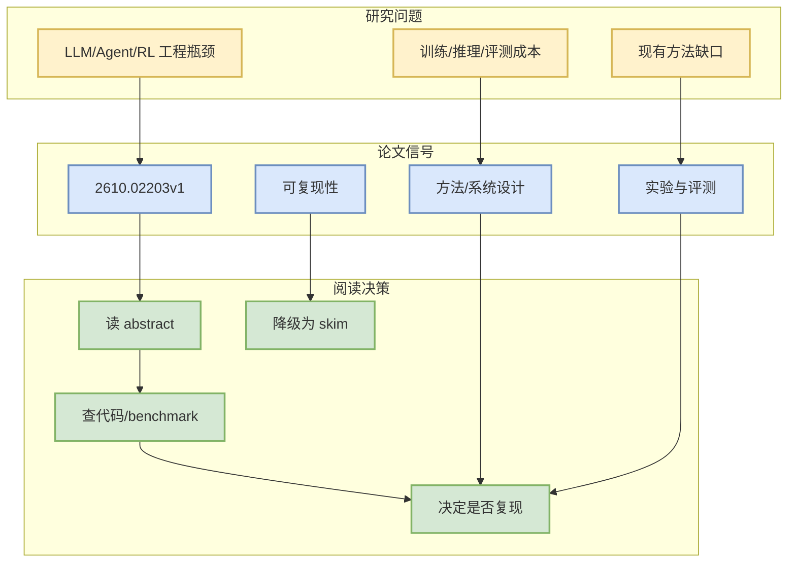

# Embedding Prediction Helps Image Generation

> 一句话结论：这是一篇来自 arXiv 的候选论文，主题与 LLM/Agent/RL/AI Infra 相关，建议按摘要先做二次筛选。

## TL;DR
- 论文来源：arXiv
- 来源类型：预印本
- 作者/机构：Sihan Xu, Ji Xie, Zilin Wang, Hui Shen, Stella X. Yu
- 发布时间：2026-10-01
- abs：https://arxiv.org/abs/2610.02203v1
- PDF：https://arxiv.org/pdf/2610.02203v1
- 代码链接：未发现

## 元信息表
| 字段 | 值 |
|---|---|
| arXiv ID | 2610.02203v1 |
| Categories | cs.CV, cs.LG |
| Authors | Sihan Xu, Ji Xie, Zilin Wang, Hui Shen, Stella X. Yu |
| Published | 2026-10-01 |
| Abs | https://arxiv.org/abs/2610.02203v1 |
| PDF | https://arxiv.org/pdf/2610.02203v1 |

## 信息压缩图示

## 摘要压缩
In diffusion transformers, a class label or a text prompt is embedded once, and the same condition is reused at every denoising step. We ask whether predicted embeddings can serve as this condition instead. Next-Embedding Predictive Autoregression (NEPA) trains a Transformer to predict the next continuous embedding in a sequence. In generation, the clean image follows the noisy image, so its embeddings are the next embeddings after the condition and the noisy image. We train a NEPA model to predict them all at once with Multi-Embedding Prediction, and in Embedding Conditioned Generation, a DiT generator is conditioned on these predictions, recomputed at every denoising step, so the conditioning signal adapts to the current noisy state. Experiments on class-conditional ImageNet $256\times256$ study the condition of the generator, the design of Multi-Embedding Prediction, and the scaling of both models. The NEPA model adds a second network to every sampling step; with it, and combined wi

## 专业解读
本条进入雷达是因为查询词限定在 LLM serving、agent evaluation、post-training、RL/world model 等方向。后续应验证论文是否提供可复现实验、代码或足够清晰的 benchmark。若只是泛 AI 应用而缺少系统/训练/评测贡献，应降级为 skim。

## 对我的影响
- AI Infra：关注是否提供吞吐、延迟、调度或分布式训练信号。
- LLM/Agent：关注是否改善工具调用、评测闭环、上下文管理。
- RL/Game AI：关注是否能迁移到 self-play、环境并行或奖励设计。

## 可信度与局限性
仅基于 arXiv API 摘要；未阅读全文 PDF。

#ai-radar #paper #arxiv
