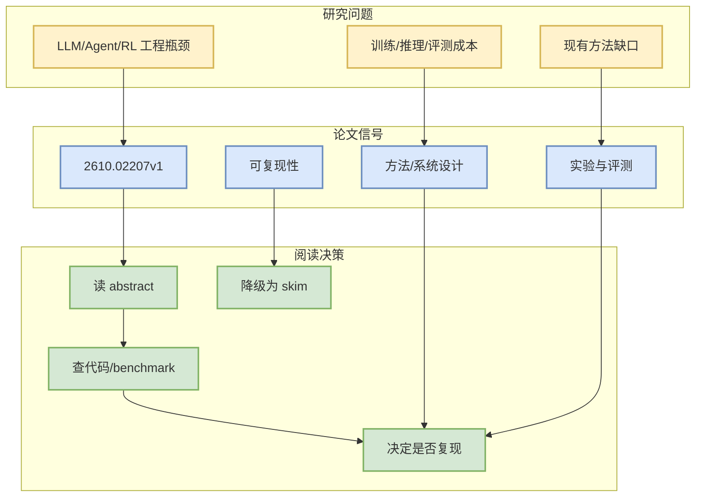

# One Basis to Animate Them All: Gaussian Blendshape Distillation for Real-Time Avatars

> 一句话结论：这是一篇来自 arXiv 的候选论文，主题与 LLM/Agent/RL/AI Infra 相关，建议按摘要先做二次筛选。

## TL;DR
- 论文来源：arXiv
- 来源类型：预印本
- 作者/机构：Ramazan Fazylov, Stamatis Lefkimmiatis, Ivan Laptev
- 发布时间：2026-10-01
- abs：https://arxiv.org/abs/2610.02207v1
- PDF：https://arxiv.org/pdf/2610.02207v1
- 代码链接：未发现

## 元信息表
| 字段 | 值 |
|---|---|
| arXiv ID | 2610.02207v1 |
| Categories | cs.CV, cs.AI, cs.HC, cs.LG |
| Authors | Ramazan Fazylov, Stamatis Lefkimmiatis, Ivan Laptev |
| Published | 2026-10-01 |
| Abs | https://arxiv.org/abs/2610.02207v1 |
| PDF | https://arxiv.org/pdf/2610.02207v1 |

## 信息压缩图示

## 摘要压缩
3D Gaussian avatars support fast rendering, however, their real-time animation is often challenged by the costly neural inference. We address this bottleneck and show that the animation of pretrained avatar models can be closely approximated by a linear combination of identity-independent blendshapes. Building on this finding, we introduce GALA (Gaussian Animation via Linear Approximation), a distillation method that replaces per-frame heavy neural decoding with a shallow coefficient predictor and a linear blend. To improve fidelity and reduce memory requirements, we propose to construct the basis using block-local PCA under a rendering-aware metric and a memory budget. Our method learns a shallow MLP network to predict blendshape coefficients and applies to various animation architectures without retraining original models. We validate GALA by accelerating the inference of three distinct avatar models for 3D animation of facial expressions and full-bodies with clothing dynamics. Acros

## 专业解读
本条进入雷达是因为查询词限定在 LLM serving、agent evaluation、post-training、RL/world model 等方向。后续应验证论文是否提供可复现实验、代码或足够清晰的 benchmark。若只是泛 AI 应用而缺少系统/训练/评测贡献，应降级为 skim。

## 对我的影响
- AI Infra：关注是否提供吞吐、延迟、调度或分布式训练信号。
- LLM/Agent：关注是否改善工具调用、评测闭环、上下文管理。
- RL/Game AI：关注是否能迁移到 self-play、环境并行或奖励设计。

## 可信度与局限性
仅基于 arXiv API 摘要；未阅读全文 PDF。

#ai-radar #paper #arxiv
