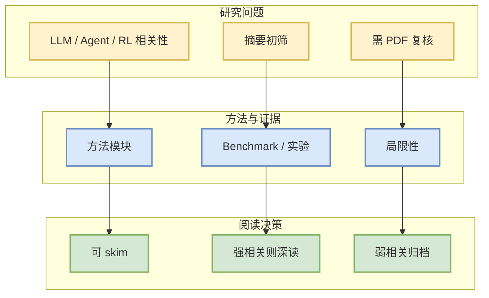

# Trust the Direction, Search the Step: Zero-and-First-Order Methods for LLM Fine-Tuning

> 一句话结论：arXiv 候选论文，需二次阅读全文确认是否对 LLM/Agent/RL/Infra 有直接工程价值。

## TL;DR
- 论文来源：arXiv
- 来源类型：预印本
- 作者/机构：Cristian McGee, El Houcine Bergou, Aritra Dutta
- 发布时间：2026-10-01
- abs：https://arxiv.org/abs/2610.02190v1
- PDF：https://arxiv.org/pdf/2610.02190v1
- 代码链接：未发现
- 类别：cs.LG, math.OC

## 论文机制图

## 摘要压缩
Step-size selection remains a central challenge in large-scale neural network optimization; conservative steps slow convergence, while aggressive steps can destabilize it. We combine \textbf{Z}ero-and-\textbf{F}irst-\textbf{O}rder optimization~(ZFO) and propose a lightweight framework that decouples direction selection from step-size. ZFO uses a trusted first-order optimizer to determine the direction and performs zeroth-order evaluations only along this one-dimensional subspace to choose how far to move. Using the current {gradient information} and two additional objective function evaluations, ZFO instances construct a local model of the objective function along the proposed direction and select a curvature-aware step within a bounded search interval. This yields an adaptive step-selection mechanism that costs less than a full line search. We provide theoretical guarantees to show that shared-sample evaluations produce reliable finite-difference curvature estimates, that the induced local model selects a near-optimal step along the search interval, and that ZFO converges to a neighborhood of a stationary point. Across the evaluated settings, language models and datasets, ZFO frequently improves optimization and final performance relative to fixed-step first-order baselines, with the magnitude and preferred local model depending on the objective. Our code is publicly available at: https://github.com/nizswan/Zeroth-First-Order-Framework.

## 对我的影响
若论文涉及 serving、post-training、agent evaluation、world model 或 RL game agent，可进入后续深读；否则仅作为低优先级论文流监控。

## 可信度与局限性
- 只基于 arXiv metadata / abstract 初筛。
- 未验证代码、benchmark 和实验可复现性。

## 相关链接
- abs：https://arxiv.org/abs/2610.02190v1
- PDF：https://arxiv.org/pdf/2610.02190v1
- Daily：[[Daily/2026-10-04]]

#AI-Radar #Paper #arXiv
