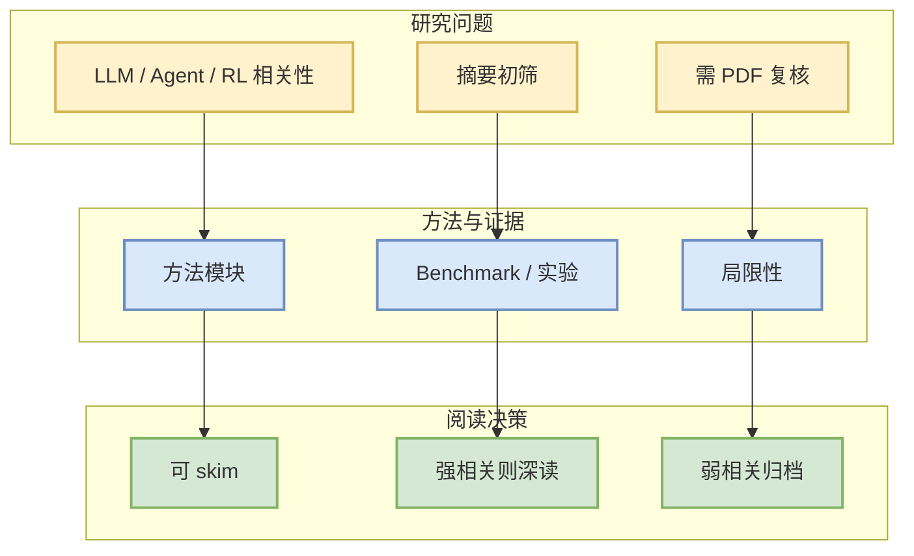

# The Missing Primitive: Diagnosing and Repairing Mathematical Reasoning in Large Language Models

> 一句话结论：arXiv 候选论文，需二次阅读全文确认是否对 LLM/Agent/RL/Infra 有直接工程价值。

## TL;DR
- 论文来源：arXiv
- 来源类型：预印本
- 作者/机构：Shuo Xing, Zilin Dai, Chengyuan Qian, Fangzhou Lin
- 发布时间：2026-10-01
- abs：https://arxiv.org/abs/2610.02191v1
- PDF：https://arxiv.org/pdf/2610.02191v1
- 代码链接：未发现
- 类别：cs.LG

## 论文机制图

## 摘要压缩
While Large Language Models (LLMs) have demonstrated striking capabilities on frontier mathematical problems, it remains unclear whether they possess the structural mathematical understanding underlying their solutions. In this paper, we take a first step toward systematically studying mathematical understanding in LLMs, from diagnosing its distinct capabilities to leveraging these findings to improve post-training. First, we introduce the notion of Mathematical Primitive to probe structural mathematical understanding and propose \hlei{}, a novel benchmark that evaluates mathematical reasoning along four distinct dimensions: Discovery, Generation, Digestion, and Execution. Second, our systematic diagnosis shows that solution accuracy masks distinct capability profiles, primitives unlock substantial latent execution capacity, and Discovery is the dominant bottleneck in mathematical reasoning. Our post-training analysis further shows that discovery-limited failures are particularly amenable to repair. Finally, building on these findings, we introduce \abs{}, a primitive-privileged self-distillation framework that selectively transfers primitive-guided reasoning into the student model. Extensive experiments demonstrate that \abs{} consistently improves mathematical reasoning over baselines across model scales and challenging benchmarks.

## 对我的影响
若论文涉及 serving、post-training、agent evaluation、world model 或 RL game agent，可进入后续深读；否则仅作为低优先级论文流监控。

## 可信度与局限性
- 只基于 arXiv metadata / abstract 初筛。
- 未验证代码、benchmark 和实验可复现性。

## 相关链接
- abs：https://arxiv.org/abs/2610.02191v1
- PDF：https://arxiv.org/pdf/2610.02191v1
- Daily：[[Daily/2026-10-04]]

#AI-Radar #Paper #arXiv
