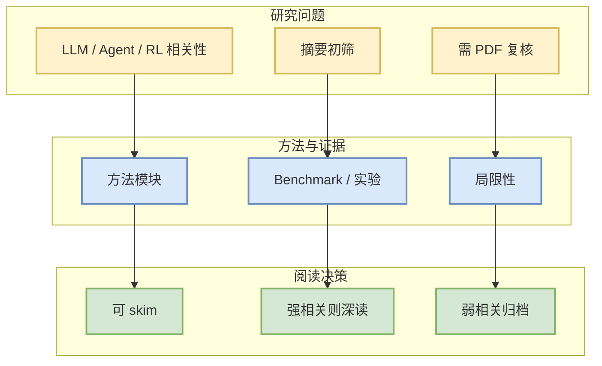

# Reconstruct, Practice, Go Real: Guided Self-Improvement for Embodied Agents

> 一句话结论：arXiv 候选论文，需二次阅读全文确认是否对 LLM/Agent/RL/Infra 有直接工程价值。

## TL;DR
- 论文来源：arXiv
- 来源类型：预印本
- 作者/机构：Yen-Jen Wang, Haozhe Jiang, Shuying Deng, Haoru Xue
- 发布时间：2026-10-01
- abs：https://arxiv.org/abs/2610.02204v1
- PDF：https://arxiv.org/pdf/2610.02204v1
- 代码链接：未发现
- 类别：cs.RO, cs.AI, eess.SY

## 论文机制图

## 摘要压缩
Building reliable robot capabilities across diverse tasks requires substantial human effort to develop and maintain skills, design rewards, and integrate perception with control. We present Reconstruct, Practice, Go Real (RPG), a framework for autonomous improvement of robot execution systems without updating model weights. RPG identifies manipulation capabilities in an offline dataset and constructs related practice tasks in simulation. During practice, RPG uses execution feedback, privileged simulator state, and available dataset videos to diagnose failures. It develops new reusable symbolic skills, refines existing skills, and revises the system prompt based on these diagnoses. Cross-task evaluation tests individual candidate changes and merged revisions before they are retained for reuse. At test time, a multimodal LLM uses the resulting system prompt and skill library to coordinate perception and robot control. On held-out initializations of 22 manipulation tasks, RPG improves task success from 28.6% after the first practice round to 95.0% after 15 rounds, outperforming all evaluated baselines, including ASPIRE (75.5%) and CaP-Agent0 powered by GPT-6 Astra Pro (60.0%). After a common calibration and hardware-adaptation procedure, the frozen system succeeds in all 30 physical trials, with ten trials on each of three tasks. Project Website: https://rpg-robot.github.io/

## 对我的影响
若论文涉及 serving、post-training、agent evaluation、world model 或 RL game agent，可进入后续深读；否则仅作为低优先级论文流监控。

## 可信度与局限性
- 只基于 arXiv metadata / abstract 初筛。
- 未验证代码、benchmark 和实验可复现性。

## 相关链接
- abs：https://arxiv.org/abs/2610.02204v1
- PDF：https://arxiv.org/pdf/2610.02204v1
- Daily：[[Daily/2026-10-04]]

#AI-Radar #Paper #arXiv
