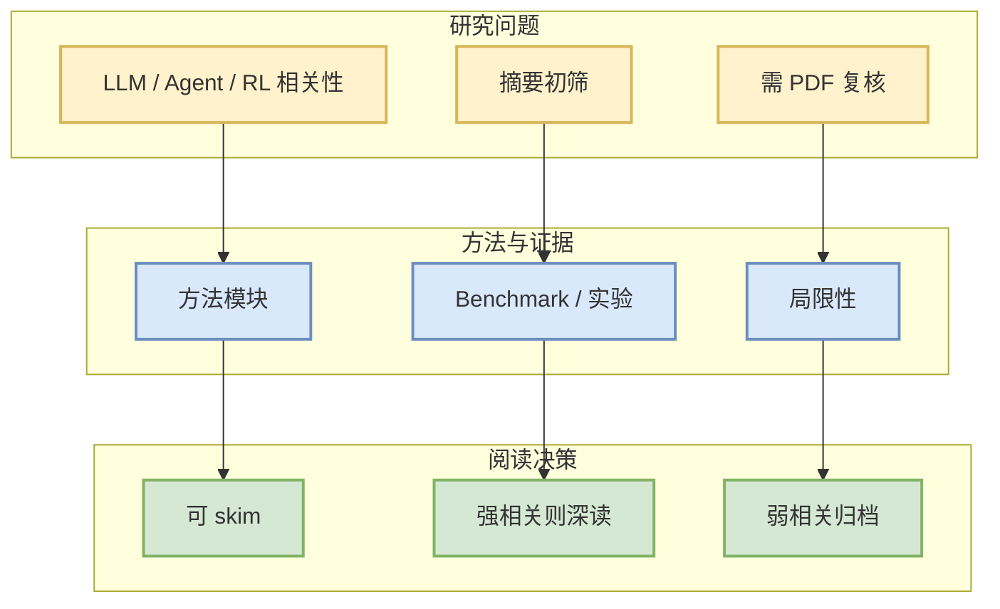

# TACO: Ternary Absolute-max Column-wise One-sparse Optimizer for LLM Fine-Tuning

> 一句话结论：arXiv 候选论文，需二次阅读全文确认是否对 LLM/Agent/RL/Infra 有直接工程价值。

## TL;DR
- 论文来源：arXiv
- 来源类型：预印本
- 作者/机构：Jichao Jiang, Cristian McGee, El Houcine Bergou, Hanqin Cai
- 发布时间：2026-10-01
- abs：https://arxiv.org/abs/2610.02199v1
- PDF：https://arxiv.org/pdf/2610.02199v1
- 代码链接：未发现
- 类别：cs.LG, math.OC

## 论文机制图

## 摘要压缩
Full-parameter fine-tuning of large language models (LLMs) incurs substantial optimizer state memory overhead, limiting the model sizes that fit on modern GPUs. Existing approaches either compress optimizer state, abandon first-order gradients, or change the update geometry while retaining dense state. The recently introduced Muon optimizer reduces optimizer memory through matrix-valued updates. Still, its geometry differs from AdamW and can lead to performance degradation when fine-tuning AdamW-pretrained models. To reduce optimizer memory without sacrificing accuracy or computational efficiency in LLM fine-tuning, we propose Ternary Absolute-max Column-wise One-sparse optimizer, or TACO, which follows Muon's operator-norm steepest-descent view but takes the geometric route further. TACO computes the exact steepest-descent direction under a dimension-normalized $1\to1$ operator norm by selecting the sign of the largest magnitude entry in each column of two-dimensional weight matrices. This retains first-order gradients while making optimizer state memory nearly negligible. Our practical TACO optimizer maintains only a small set of low precision gradient components per column, reducing persistent optimizer state by $174\times$ relative to AdamW8bit (from 27.7 GB to 0.16 GB) and peak training memory by $2.9\times$ (from 80.6 GB to 27.5 GB) on OPT-13B, while achieving comparable accuracy and runtime. TACO further enables full-parameter fine-tuning of 30-32B-parameter models on a single 80 GB H100 GPU across multiple model families and tasks.

## 对我的影响
若论文涉及 serving、post-training、agent evaluation、world model 或 RL game agent，可进入后续深读；否则仅作为低优先级论文流监控。

## 可信度与局限性
- 只基于 arXiv metadata / abstract 初筛。
- 未验证代码、benchmark 和实验可复现性。

## 相关链接
- abs：https://arxiv.org/abs/2610.02199v1
- PDF：https://arxiv.org/pdf/2610.02199v1
- Daily：[[Daily/2026-10-05]]

#AI-Radar #Paper #arXiv
