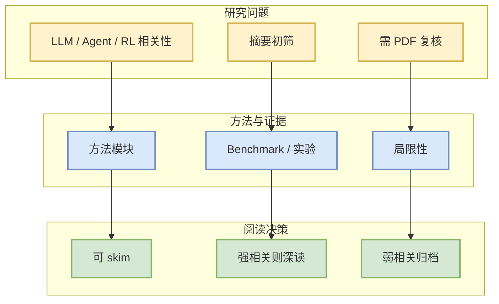

# KaliBench: A Fine-Grained Benchmark for Cybersecurity Tool Use on Kali Linux with Runtime-Free Verifiable Rewards

> 一句话结论：arXiv 候选论文，需二次阅读全文确认是否对 LLM/Agent/RL/Infra 有直接工程价值。

## TL;DR
- 论文来源：arXiv
- 来源类型：预印本
- 作者/机构：Pengfei Li, Naufal Suryanto, Sicheng Zhang, Muzammal Naseer
- 发布时间：2026-10-01
- abs：https://arxiv.org/abs/2610.02206v1
- PDF：https://arxiv.org/pdf/2610.02206v1
- 代码链接：未发现
- 类别：cs.CL, cs.AI, cs.CR

## 论文机制图

## 摘要压缩
LLMs are increasingly applied to cybersecurity workflows, where they are expected to translate analysts' intent into tool invocations. However, existing evaluations focus on knowledge-based assessments or end-to-end agentic tasks, and do not directly measure LLMs' ability to generate executable commands for real-world cybersecurity tools. This gap is critical because cybersecurity operations rely on strict command-line interfaces (CLIs), where minor syntax errors, incorrect flag--value bindings, or argument misordering can invalidate execution. We introduce KaliBench, a fine-grained benchmark and dataset for natural-language--to--CLI translation on Kali Linux, comprising 8,504 query--command pairs spanning 1,642 tools across 23 capability dimensions and 5 security phases. KaliBench is constructed via a manuscript-grounded pipeline with deterministic canonicalization and alias-aware evaluation, enabling precise and reproducible assessment of tool selection and argument construction. To ensure both semantic correctness and practical executability, we develop a multi-stage verification pipeline that combines LLM-based validation, sandboxed terminal execution, and human-in-the-loop refinement. Building on these fine-grained, deterministic signals, KaliBench further enables runtime-free verifiable rewards for training. Across three evaluation modes and 24 configurations of general-purpose and security-focused open-weight models, no open-weight model exceeds 42% exact-command accuracy in the unrestricted setting, highlighting the difficulty of accurate CLI-based cybersecurity tool use without explicit tool hints. We further show that supervised fine-tuning and reinforcement learning with verifiable rewards derived from KaliBench significantly improve an 8B model and achieve performance comparable to a 685B MoE model.

## 对我的影响
若论文涉及 serving、post-training、agent evaluation、world model 或 RL game agent，可进入后续深读；否则仅作为低优先级论文流监控。

## 可信度与局限性
- 只基于 arXiv metadata / abstract 初筛。
- 未验证代码、benchmark 和实验可复现性。

## 相关链接
- abs：https://arxiv.org/abs/2610.02206v1
- PDF：https://arxiv.org/pdf/2610.02206v1
- Daily：[[Daily/2026-10-05]]

#AI-Radar #Paper #arXiv
