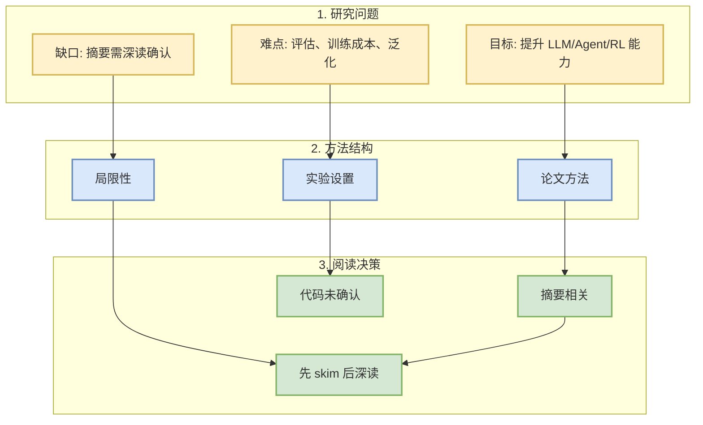
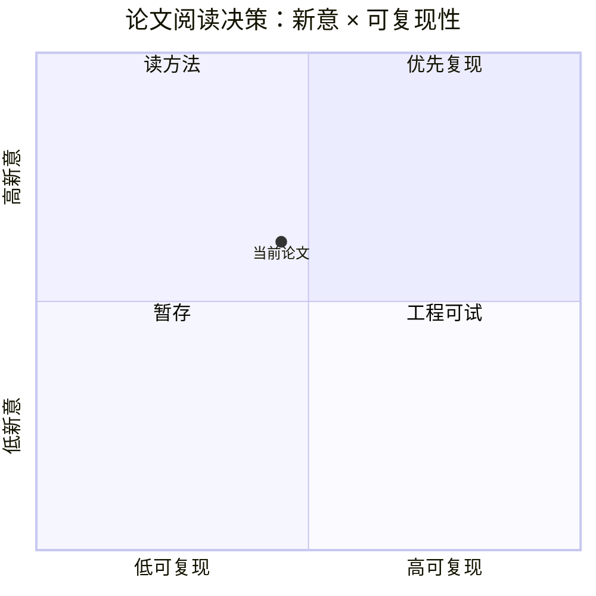

# Robot Learning with Visual Predicted Force

> 类型：论文
> 大类：论文
> 小类：LLM / Agent / RL / AI Infra
> 推荐等级：可 skim
> 创建日期：2026-10-06
> 原文链接：https://arxiv.org/abs/2610.04741v1
> PDF：https://arxiv.org/pdf/2610.04741v1
> 网页详情：https://github.com/dyt27666-oss/AI-news-report-obsidians/blob/main/Papers/arXiv/2026-10-06/robot-learning-with-visual-predicted-force.md
> 返回日报：[[Daily/2026-10-06]]

## 一句话结论

Force-aware manipulation typically relies on specialized force or tactile sensors. We show that force-aware manipulation can instead be achieved through visual force prediction from the deformation of a compliant Fin Ray gripper. Our approach trains two models

## TL;DR

- **研究问题**：围绕 LLM/Agent/RL 的近期 arXiv 论文信号。
- **核心方法**：需深读 PDF 后确认；当前基于摘要做初筛。
- **关键结果**：摘要显示与用户关注方向相关，适合 skim。
- **对我的价值**：用于发现 serving、post-training、agent eval 或 world model 方向的新方法。
- **建议动作**：先读 abstract 与图，再决定是否复现。

## 论文信息

| 字段 | 内容 |
|---|---|
| 论文来源 | arXiv |
| 来源类型 | 预印本 |
| 标题 | Robot Learning with Visual Predicted Force |
| 作者/机构 | Haonan Chen, Feiyang Wu, Yuxiang Ma, Mustafa Mete |
| 发布时间 | 2026-10-03 |
| arXiv | [abs](https://arxiv.org/abs/2610.04741v1) |
| PDF | [pdf](https://arxiv.org/pdf/2610.04741v1) |
| 代码 | 未发现 |
| 方向 | LLM / Agent / RL |

## 方法/系统图示

### 辅助图：阅读/复现决策矩阵

## 专业解读

Force-aware manipulation typically relies on specialized force or tactile sensors. We show that force-aware manipulation can instead be achieved through visual force prediction from the deformation of a compliant Fin Ray gripper. Our approach trains two models 当前只基于 arXiv 元数据和摘要，不伪造实验细节。建议优先检查 benchmark 是否贴近真实 LLM 工程负载、是否给出代码和 ablation，以及方法是否可迁移到 serving/post-training/agent eval。

## 通俗解释

这是一篇需要先看摘要和图的候选论文；如果核心实验扎实，再进入深读。

## 方法拆解

| 组件 | 作用 | 输入 | 输出 | 关键假设 |
|---|---|---|---|---|
| 问题定义 | 判断是否相关 | 摘要/标题 | 主题归类 | 摘要足够准确 |
| 方法模块 | 待深读确认 | PDF | 技术机制 | 论文未 withdrawn |
| 实验信号 | 判断价值 | benchmark | 可信度 | benchmark 有代表性 |

## 对我的影响

| 维度 | 影响 | 建议动作 |
|---|---|---|
| AI Infra | 可能影响系统设计或评估 | skim PDF |
| LLM 工程 | 可能给 post-training/serving 新思路 | 检查代码 |
| RL / Game AI | 若含 self-play/world model，可复用 | 加入观察 |
| Agent / Eval | 检查 eval protocol | 建小 benchmark |

## 相关链接

- 原文：https://arxiv.org/abs/2610.04741v1
- PDF：https://arxiv.org/pdf/2610.04741v1
- 网页详情：https://github.com/dyt27666-oss/AI-news-report-obsidians/blob/main/Papers/arXiv/2026-10-06/robot-learning-with-visual-predicted-force.md

## 标签

#ai-radar #paper
