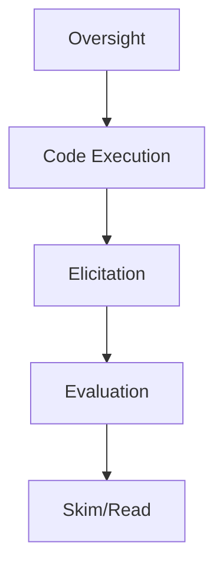

# PyINE: A Framework for Scalable Elicitation and Oversight via Code Execution

> 来源：arXiv / 预印本
> 原文：https://arxiv.org/abs/2610.04737v1

## 一句话结论
该论文候选关注 code execution for oversight，可能与 agent eval / scalable oversight 相关。

## 可信度
仅做初筛，需后续阅读全文确认实验与适用范围。

#ai-radar #paper #arxiv
