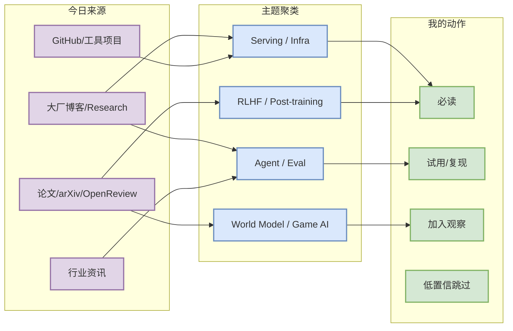

# AI Radar Daily - {{date}}

> 生成时间：{{datetime_bj}}
> 范围：AI Infra / LLM / RL / Game AI / 大厂博客 / 论文 / GitHub / 行业资讯
> 说明：日报是总览导航页，不是全部正文。Obsidian 中点 `[[详情页]]`，Telegram/GitHub 中点“网页详情”。

## 0. 今日结论

- 今日最值得关注：{{top_takeaway}}
- 对 AI Infra 的直接影响：{{infra_takeaway}}
- 对 LLM 训练 / 推理 / Agent 的影响：{{llm_takeaway}}
- 对 RL / 游戏模型训练的影响：{{rl_takeaway}}
- 建议今天深读：{{reading_plan}}

## 1. 今日态势图

日报必须先给一个信息压缩图，而不是直接进入长表。



## 2. 必读卡片区

用 3-5 张卡片/Callout 展示最值得读的内容。

> [!important] {{title_1}}
> - 大类：{{major_category_1}}
> - 小类：{{minor_category_1}}
> - 重点：{{summary_1}}
> - 为什么重要：{{why_important_1}}
> - 详情：[[{{note_path_1}}]] / [网页详情]({{github_blob_url_1}}) / [原文]({{source_url_1}})

> [!tip] {{title_2}}
> - 大类：{{major_category_2}}
> - 小类：{{minor_category_2}}
> - 重点：{{summary_2}}
> - 为什么重要：{{why_important_2}}
> - 详情：[[{{note_path_2}}]] / [网页详情]({{github_blob_url_2}}) / [原文]({{source_url_2}})

## 3. 优先级矩阵

```mermaid
quadrantChart
  title 今日内容优先级：影响力 × 可落地性
  x-axis 低可落地性 --> 高可落地性
  y-axis 低影响力 --> 高影响力
  quadrant-1 立即读/试
  quadrant-2 读论文/看趋势
  quadrant-3 暂存
  quadrant-4 可工具化
  {{item_1}}: [0.82, 0.88]
  {{item_2}}: [0.62, 0.80]
  {{item_3}}: [0.75, 0.52]
```

## 4. 分类清单

每条必须给出足够长的“为什么重要”，不要只写一句截断描述。

| 标签 | 大类 | 小类 | 标题 | 重点概括 | 为什么重要 | Obsidian 详情 | 网页详情 | 原文 |
|---|---|---|---|---|---|---|---|---|
| 必读 | 论文/博客/资讯/GitHub | 主题/公司/人物 | {{title}} | {{summary_zh}} | {{why_it_matters}} | [[{{note_path}}]] | [网页详情]({{github_blob_url}}) | [原文]({{source_url}}) |

## 5. 大厂资讯 / 工程博客 / Research

大厂博客必须显式标注发布方/大厂，不允许只写“博客”。发布方示例：OpenAI、Anthropic、Google DeepMind、Meta AI、NVIDIA、Microsoft、Hugging Face、腾讯、字节、SpaceAI。

### 5.1 公司来源扫描矩阵

即使没有高相关新项，也必须保留这一节，避免误以为未扫描。

| 公司/实验室 | 来源/栏目 | 今日状态 | 高相关条数 | 代表条目 | 备注 |
|---|---|---|---:|---|---|
| OpenAI | News / Research | {{status}} | {{count}} | {{title_or_none}} | {{note}} |
| Anthropic | News / Research / Engineering | {{status}} | {{count}} | {{title_or_none}} | {{note}} |
| Google DeepMind | Blog / Research | {{status}} | {{count}} | {{title_or_none}} | {{note}} |
| Meta AI | Blog / Research | {{status}} | {{count}} | {{title_or_none}} | {{note}} |
| NVIDIA | Technical Blog / AI | {{status}} | {{count}} | {{title_or_none}} | {{note}} |
| Microsoft | Research AI | {{status}} | {{count}} | {{title_or_none}} | {{note}} |
| Hugging Face | Blog / Papers / Releases | {{status}} | {{count}} | {{title_or_none}} | {{note}} |
| 腾讯 | AI Lab / 技术博客 | {{status}} | {{count}} | {{title_or_none}} | {{note}} |
| 字节 | Seed / 技术博客 | {{status}} | {{count}} | {{title_or_none}} | {{note}} |
| SpaceAI | Blog / News | {{status}} | {{count}} | {{title_or_none}} | {{note}} |

### 5.2 高相关大厂条目

| 标签 | 发布方/大厂 | 栏目/来源 | 标题 | 重点概括 | 工程/算法影响 | Obsidian 详情 | 网页详情 | 原文 |
|---|---|---|---|---|---|---|---|---|

## 6. GitHub 高 star Top 10

必须单独输出 10 条；如果不足 10 条，必须解释 API/rate limit/过滤原因。

| 排名 | repo | stars | forks | language | updated_at | topics | 重点概括 | 是否值得试用 | Obsidian 详情 | 原文 |
|---:|---|---:|---:|---|---|---|---|---|---|---|

## 7. GitHub star 增长最快 Top 10

必须单独输出 10 条。优先使用历史 snapshot 计算 `stars_delta`；冷启动时必须标注“冷启动代理，非真实日增”。

| 排名 | repo | stars_delta | stars | forks | language | updated_at | 增长依据 | 重点概括 | Obsidian 详情 | 原文 |
|---:|---|---:|---:|---:|---|---|---|---|---|---|

## 8. 论文

论文必须标注来源平台和来源类型，例如 arXiv、OpenReview、Semantic Scholar、Papers with Code、公司 Research Blog、会议论文页。不要只写标题。

### 8.1 {{topic_name}}

| 标签 | 论文来源 | 论文 | 作者/机构 | 重点概括 | 工程/研究价值 | Obsidian 详情 | 网页详情 | PDF/原文 |
|---|---|---|---|---|---|---|---|---|

## 9. 资讯 / 其他 GitHub 项目

### 9.1 {{topic_name}}

| 标签 | 来源 | 标题 | 重点概括 | 对我有什么用 | Obsidian 详情 | 网页详情 | 原文 |
|---|---|---|---|---|---|---|---|

## 10. 按主题索引

### AI Infra / Serving / Training

- [[{{note_path}}]] - {{short_reason}}

### LLM / Agent / RAG / Evaluation

- [[{{note_path}}]] - {{short_reason}}

### RL / Game AI / World Model

- [[{{note_path}}]] - {{short_reason}}

### 公司 / 实验室

- OpenAI: [[{{note_path}}]]
- Anthropic: [[{{note_path}}]]
- DeepMind: [[{{note_path}}]]
- Meta: [[{{note_path}}]]
- NVIDIA: [[{{note_path}}]]
- 腾讯 / 字节 / 国内大厂: [[{{note_path}}]]

### 大牛 / 作者

- {{person_or_author}}: [[{{note_path}}]]

## 11. 值得后续深挖

| 标签 | 大类 | 小类 | 标题 | 后续动作 | Obsidian 详情 | 原文 |
|---|---|---|---|---|---|---|

## 12. 采集失败或低置信来源

- 无 / {{failed_sources}}

## 13. 归档标签

#ai-radar #daily #ai-infra #llm #rl
