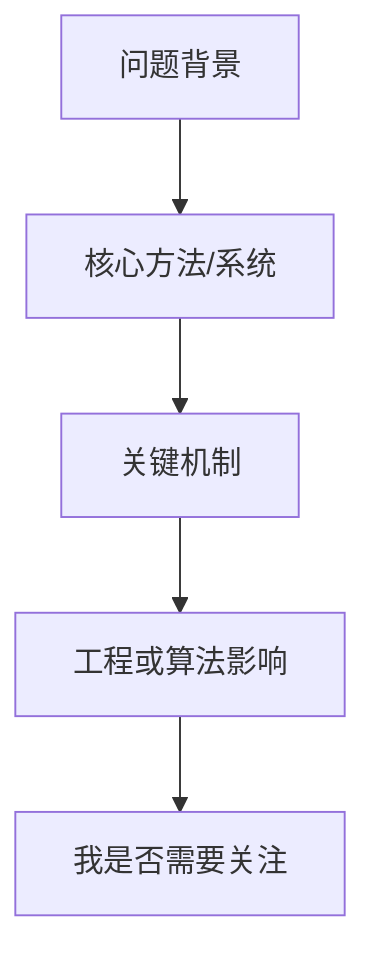

# {{title}}

> 类型：{{type}}
> 分类：{{category}}
> 推荐等级：{{priority}}
> 创建日期：{{date}}
> 原文链接：{{source_url}}

## 一句话结论

{{one_line_takeaway}}

## 元信息

- 来源：{{source_name}}
- 作者/机构：{{authors_or_org}}
- 发布时间：{{published_at}}
- 代码链接：{{code_url}}
- PDF：{{pdf_url}}
- 相关标签：{{tags}}

## 专业解读

{{professional_explanation}}

## 通俗解释

{{plain_explanation}}

## 图示

优先使用文章原图；如果没有合适原图，用 Mermaid 生成 LLM 整理的理解图。图示必须服务理解，不要为了装饰而画。

## 核心要点

- {{point_1}}
- {{point_2}}
- {{point_3}}

## 对我的影响

- AI Infra：{{infra_impact}}
- LLM 工程：{{llm_impact}}
- RL / Game AI：{{rl_impact}}
- 是否值得深读/试用/复现：{{action}}

## 局限性 / 风险

- {{limitation_1}}
- {{limitation_2}}

## 相关链接

- 原文：{{source_url}}
- 代码：{{code_url}}
- PDF：{{pdf_url}}
- 相关卡片：{{related_notes}}

## 标签

#ai-radar {{tags}}
