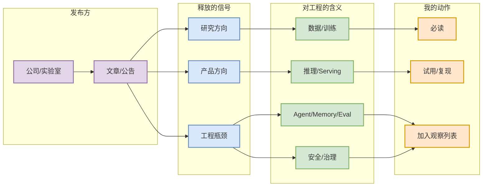
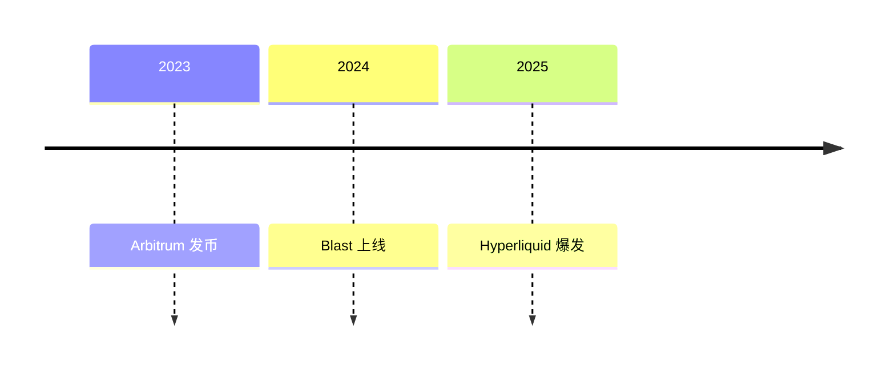
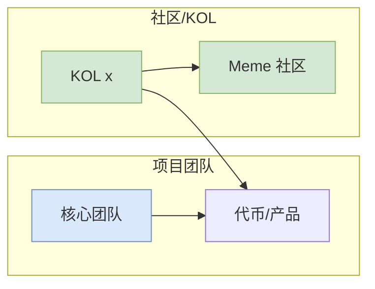
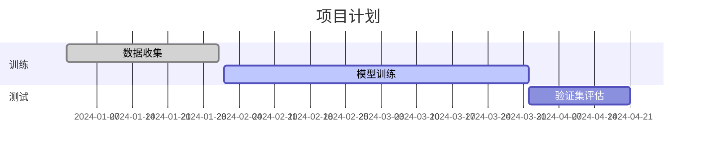

# Mermaid 图示模式库

Mermaid 是一种基于文本的图表语言，可在 Obsidian 中原生使用，无需额外插件即可生成流程图、时序图、思维导图、时间线等多种图表。它特别适合将知识和研究内容以可视化形式**压缩**呈现。例如，在 AI Radar 详情页中，常用 **子图 (subgraph)**、**类别样式 (classDef)**、**内部链接** 等功能来分组关键节点、统一配色，并保持文本与结构简洁。以下归纳了一些常见的信息结构模式，每种模式附带示例代码和配色建议，可直接复制粘贴到 Obsidian 的 ```mermaid``` 代码块中使用。

## 1. 论文机制图 (Research Paper Overview)
- **用途**：总结科研论文的结构脉络，包括研究目标、瓶颈/缺口、方法模块、训练/推理流程以及结果证据等。通过多层次子图展示从“研究问题 → 方法模块 → 执行流程 → 证据/决策”的逻辑流程，帮助快速了解论文核心。
- **结构**：示例中将“研究问题 (Q)”、“方法模块 (M)”、“流程 (P)”、“证据 (E)”分别用 `subgraph` 包含相关节点。箭头表示因果或数据流向。节点简短明了，以突出关键信息。
- **样式**：使用 `classDef` 定义类别背景色，再通过 `class` 将节点归类。例如，可为“问题/瓶颈”设淡橙填充，为“方法/模块”设淡蓝色，为“证据/评估”设淡绿色，为“风险/局限”设淡红色。示例代码如下：


复制上述代码到 Obsidian，即可生成与示例一致的层次流程图。节点归类后，色块背景对比明显，帮助快速区分不同模块。在示例中，`classDef` 的使用方式参考官方文档，通过统一 CSS 样式实现一致的配色和边框。

## 2. 大厂博客信号图 (Corporate Announcement Signals)
- **用途**：剖析大公司/实验室的公告、博客或论文如何传递产品、研究或技术瓶颈等信号，并指引我们相应的行动（如阅读、试用等）。  
- **结构**：可用 `flowchart LR`（或 `TB`）按横向分列，将流程分为“发布方 (公司/实验室) → 信号 (产品方向/研究方向/工程瓶颈) → 工程影响 (如数据、推理、安全等) → 我们的动作（必读、复现、观察等）”四段。箭头表示信息流向和逻辑关系。  
- **配色**：为不同分组定义颜色。如示例中给“公司/文章”使用紫色系、给“信号”使用浅蓝色、“基础设施意义”使用浅绿色、“行动”使用浅橙色，借助 `classDef` 区分视觉区域。  
- **示例**：



这一模式常用于**信息过滤**：将外部发布的信号映射到自身关注点上。使用分组（subgraph）可以清晰标示各层级内容，并用 `classDef` 区分不同主题颜色。

## 3. AI 基础设施项目架构图
- **用途**：描述 AI 平台或项目从工作负载到系统组件再到硬件依赖的完整架构，以及最终的性能、成本等结果。  
- **结构**：通常采用 `flowchart TB`，从顶部工作负载 (Workload) 开始，经过系统核心组件 (System)，然后到硬件 (Hardware)，最终到效果 (Outcome)。箭头展现调度和依赖关系。  
- **配色**：为每个层级设定不同颜色，例如示例中工作负载用浅橙、系统核心用浅蓝、硬件用浅紫、结果用浅绿，突出不同内容块。  
- **示例**：


该模式适合展示**系统架构和数据/控制流**：上层为输入负载，中间为核心调度和状态管理，下层为硬件，最后用结果节点表示优化目标或存在风险。通过 `classDef` 统一风格，使图表更具层次感和美观。

## 4. 时间线 (Timeline)
- **用途**：展示技术、产品或研究的关键事件时序。例如记录模型发行、框架发布等里程碑。  
- **方法**：可以用纯 Markdown 的标题加无序列表（如示例），也可用 Mermaid 的时间线或甘特图功能。Mermaid 原生支持 `timeline` 图（需要新版支持）。  
- **示例**：Markdown 列表或 Mermaid 语法均可。

Markdown 形式示例：
```markdown
## Timeline

2023  
- Arbitrum 发币  
2024  
- Blast 上线  
2025  
- Hyperliquid 爆发  
```

Mermaid 时间线示例：


这两种效果类似。使用 Mermaid 时间线可以生成可视化横轴图，但部分旧版 Obsidian 可能暂不支持（可使用插件或更新到支持 v10+ 的 Mermaid）。无论哪种方式，都能帮助梳理发展脉络。

## 5. 关系网（Graph / Network）
- **用途**：可视化实体（如项目方、团队成员、合作伙伴、链上地址、KOL 等）之间的**关联关系**。有助于了解生态结构或社群网络。  
- **结构**：使用 `graph LR`（或 TB/BT/RL）画无中心树或网络状图。节点可分组（`subgraph`）或单独高亮，并用箭头或双向线表示联系。  
- **配色/样式**：可为不同实体类别定义颜色（如团队 vs 社区 vs 代币），并使用 `class` 给重要节点加标记。借助 `internal-link` 类让节点文本变成 Obsidian 笔记链接。  
- **示例**：


在这个例子中，我们用 `subgraph` 简要分组，用 `classDef` 使“核心团队”节点呈现蓝色背景、“社区/KOL”节点呈现绿背景。通过 `A1 --> A2` 等箭头表示关系链。若需要可加 `class A1 internal-link;` 使节点链接到笔记（前提是存在同名文档）。

## 6. 其它常用图表
- **甘特图 (Gantt)**：展示计划/进度或任务时间序列，可用来规划研究路线。Mermaid 支持 `gantt` 语法。  
- **饼图 (Pie)**：用来表示占比，如市场份额、功能分布等。Mermaid 有 `pie` 语法。  
- **象限图 (Quadrant)**：常用于风险收益、影响力-投入等二维评估。Mermaid 支持 `quadrantChart`。  
- **石川图 (Ishikawa / 鱼骨图)**：分析问题原因，例如在识别瓶颈或风险时使用。Mermaid 提供 `flowchart` 结合特定布局或独立的 `fish` 语法。  
- **看板图 (Kanban)**：如果需要展示任务状态，可用 Mermaid 的 `kanban` 语法，支持拖动列。  
- **Wardley 地图**：战略级图，可借助 Mermaid 的 `wardley` 语法绘制。

以上这些图表类型均在 Mermaid 官方文档中有示例。在 Obsidian 中使用时，只需在代码块头写 `mermaid`，即可渲染。例如：


## 7. 样式与配色建议
- **统一主题**：使用 `classDef` 可以轻松统一节点样式。按照功能或层次给不同类别节点设置统一填充色和边框。可采用柔和色调（如示例中的浅橙、浅蓝、浅绿），提高可读性。切忌使用过多强烈颜色，防止信息过载。  
- **内部链接**：在 Obsidian 中，可以给节点加上 `class 某类 internal-link;`（或直接在文本中用 `[[]]`）让节点可点击跳转到笔记。这使图示与知识库双向联动，方便导航。  
- **文本格式**：Mermaid 支持“Markdown 字符串”，可用 `**粗体**`、`*斜体*` 等。对于较长标题可以自动换行，避免节点过宽。  
- **布局方向**：根据内容选择合适方向（TB、LR、BT、RL）。例如流程通常用 TB（自上而下）；关系网可用 LR 扩展；子图内也可指定方向。  
- **外部样式**：尽量用内置的 `classDef` 样式，不推荐在外部 CSS 强行覆盖，因 Mermaid 内部样式较高优先级。

## 8. 测试与示例
以上示例代码可直接复制到 Obsidian 的 ```mermaid``` 代码块中查看效果（Obsidian 支持原生渲染）。若想调整或尝试其他模式，可使用官方[Mermaid Live Editor](https://mermaid-js.github.io/mermaid-live-editor)进行在线编辑和预览。结合社区经验和官方文档，我们可以根据实际需求灵活组合子图、类、样式与交互。

**参考资料：** Obsidian 官方文档和社区教程介绍了 Mermaid 的用法，Mermaid 官方文档提供了各种图表语法示例。可根据这些资源扩展更多模板与风格。

