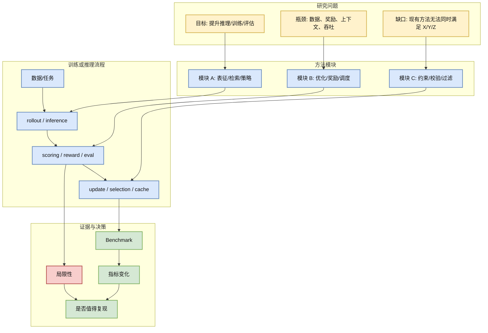
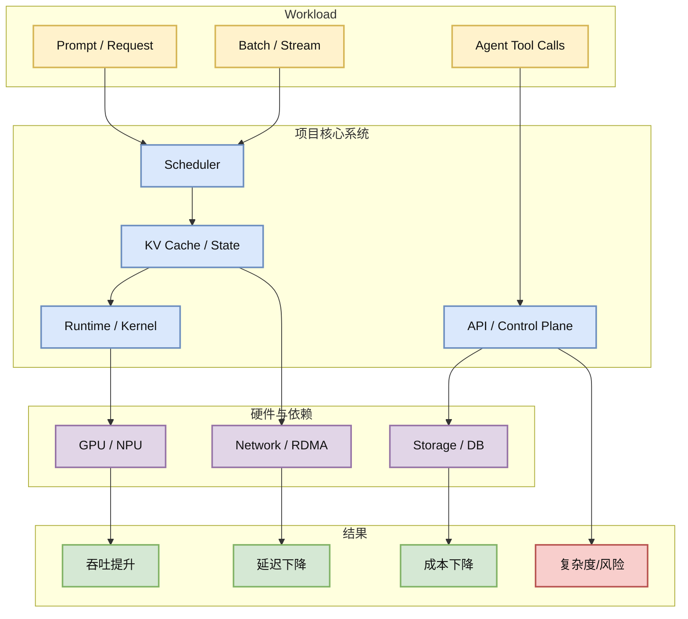

# Mermaid 图示模式库

这些模式用于 AI Radar 详情页。Obsidian 支持 Mermaid，优先用这些结构压缩信息。

## 1. 论文机制图

```mermaid
flowchart TB
  subgraph Q[研究问题]
    Q1[目标: 提升推理/训练/评估]
    Q2[瓶颈: 数据、奖励、上下文、吞吐]
    Q3[缺口: 现有方法无法同时满足 X/Y/Z]
  end

  subgraph M[方法模块]
    M1[模块 A: 表征/检索/策略]
    M2[模块 B: 优化/奖励/调度]
    M3[模块 C: 约束/校验/过滤]
  end

  subgraph P[训练或推理流程]
    D[数据/任务] --> R[rollout / inference]
    R --> S[scoring / reward / eval]
    S --> U[update / selection / cache]
  end

  subgraph E[证据与决策]
    E1[Benchmark]
    E2[指标变化]
    E3[局限性]
    E4[是否值得复现]
  end

  Q1 --> M1 --> R
  Q2 --> M2 --> S
  Q3 --> M3 --> U
  U --> E1 --> E2 --> E4
  S --> E3 --> E4

  classDef problem fill:#fff2cc,stroke:#d6b656,stroke-width:2px,color:#111;
  classDef method fill:#dae8fc,stroke:#6c8ebf,stroke-width:2px,color:#111;
  classDef evidence fill:#d5e8d4,stroke:#82b366,stroke-width:2px,color:#111;
  classDef risk fill:#f8cecc,stroke:#b85450,stroke-width:2px,color:#111;
  class Q1,Q2,Q3 problem;
  class M1,M2,M3,D,R,S,U method;
  class E1,E2,E4 evidence;
  class E3 risk;
```

## 2. 大厂博客信号图

```mermaid
flowchart LR
  subgraph Source[发布方]
    C[公司/实验室]
    A[文章/公告]
  end

  subgraph Signal[释放的信号]
    S1[产品方向]
    S2[研究方向]
    S3[工程瓶颈]
  end

  subgraph Infra[对工程的含义]
    I1[数据/训练]
    I2[推理/Serving]
    I3[Agent/Memory/Eval]
    I4[安全/治理]
  end

  subgraph Action[我的动作]
    R1[必读]
    R2[试用/复现]
    R3[加入观察列表]
  end

  C --> A --> S1
  A --> S2
  A --> S3
  S1 --> I2
  S2 --> I1
  S3 --> I3
  S3 --> I4
  I1 --> R1
  I2 --> R2
  I3 --> R3
  I4 --> R3

  classDef company fill:#e1d5e7,stroke:#9673a6,stroke-width:2px,color:#111;
  classDef signal fill:#dae8fc,stroke:#6c8ebf,stroke-width:2px,color:#111;
  classDef infra fill:#d5e8d4,stroke:#82b366,stroke-width:2px,color:#111;
  classDef action fill:#ffe6cc,stroke:#d79b00,stroke-width:2px,color:#111;
  class C,A company;
  class S1,S2,S3 signal;
  class I1,I2,I3,I4 infra;
  class R1,R2,R3 action;
```

## 3. AI Infra 项目架构图

```mermaid
flowchart TB
  subgraph Workload[Workload]
    W1[Prompt / Request]
    W2[Batch / Stream]
    W3[Agent Tool Calls]
  end

  subgraph System[项目核心系统]
    S1[Scheduler]
    S2[KV Cache / State]
    S3[Runtime / Kernel]
    S4[API / Control Plane]
  end

  subgraph Hardware[硬件与依赖]
    H1[GPU / NPU]
    H2[Network / RDMA]
    H3[Storage / DB]
  end

  subgraph Outcome[结果]
    O1[吞吐提升]
    O2[延迟下降]
    O3[成本下降]
    O4[复杂度/风险]
  end

  W1 --> S1
  W2 --> S1
  W3 --> S4
  S1 --> S2 --> S3
  S3 --> H1
  S2 --> H2
  S4 --> H3
  H1 --> O1
  H2 --> O2
  H3 --> O3
  S4 --> O4

  classDef workload fill:#fff2cc,stroke:#d6b656,stroke-width:2px,color:#111;
  classDef system fill:#dae8fc,stroke:#6c8ebf,stroke-width:2px,color:#111;
  classDef hardware fill:#e1d5e7,stroke:#9673a6,stroke-width:2px,color:#111;
  classDef outcome fill:#d5e8d4,stroke:#82b366,stroke-width:2px,color:#111;
  classDef risk fill:#f8cecc,stroke:#b85450,stroke-width:2px,color:#111;
  class W1,W2,W3 workload;
  class S1,S2,S3,S4 system;
  class H1,H2,H3 hardware;
  class O1,O2,O3 outcome;
  class O4 risk;
```
