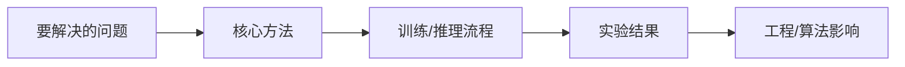

# {{paper_title}}

> 类型：论文
> 分类：{{category}}
> 推荐等级：{{priority}}
> 创建日期：{{date}}
> 原文链接：{{paper_url}}

## 一句话结论

{{one_line_takeaway}}

## 论文信息

- 标题：{{paper_title}}
- 作者/机构：{{authors}}
- 发布时间：{{published_at}}
- arXiv：{{arxiv_url}}
- PDF：{{pdf_url}}
- 代码：{{code_url}}

## 专业解读

{{professional_explanation}}

## 通俗解释

{{plain_explanation}}

## 方法图示

优先从论文中引用关键图；如果无法稳定获取图片，则用 Mermaid 画一张“问题-方法-结果-影响”的理解图。

## 解决什么问题

{{problem}}

## 核心方法

- {{method_1}}
- {{method_2}}
- {{method_3}}

## 和已有工作的差异

{{difference}}

## 实验与证据

{{evidence}}

## 局限性

- {{limitation_1}}
- {{limitation_2}}

## 对我的影响

- AI Infra：{{infra_impact}}
- LLM 工程：{{llm_impact}}
- RL / Game AI：{{rl_impact}}
- 建议动作：{{action}}

## 标签

#ai-radar #paper {{tags}}
